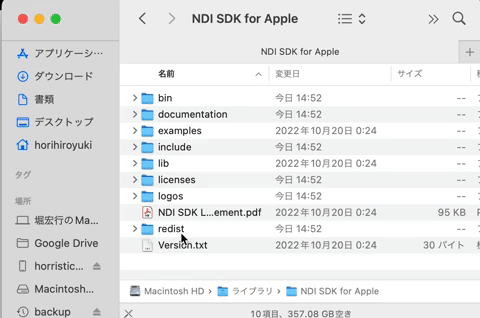
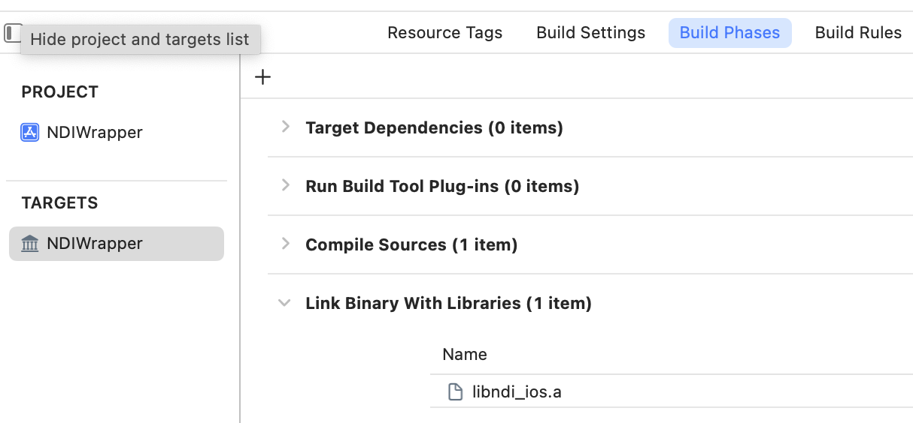

# Swift Hands Tracking App with NDI for iOS

## description
<br>


<p>Hand and Fingers detection by iOS using mediapipe.
Video and finger locations is sent via NDI.
finger locations are in NDI header infomation.</p>

<br>

## builds
1. build NDIWrapper
   1. donwload [NDI® Software Developer Kit](https://www.ndi.tv/sdk/)<br><br>
   
   <br><br>
   2. add **NDI SDK for Apple/lib/iOS/libndi_ios.a** to *Link Binary With Libraries* in *Build Phases*
    <br><br><br><br>
   3. build NDIWrapper for Any iOS Device ( make sure libNDIWrapper.a is made)

2. build and run HandTrackingApp
   1. locate *libNDIWrapper.a* in HandTrackingApp/HandTrackingApp/frameworks
   2. Run app on your device

## how to use

### *deta format*
Hand landmarks are sent in below xml format in NDI metadata.
```
<data><hand><landmark pos="0.60732925,0.58144265,3.1151734e-07"/><landmark pos="0.56505203,0.5484998,-0.026531346"/><landmark pos="0.53898305,0.48046944,-0.04208244"/><landmark pos="0.5248321,0.4197938,-0.05130074"/><landmark pos="0.5058341,0.3753905,-0.06021262"/><landmark pos="0.5713198,0.5101056,-0.06720933"/><landmark pos="0.5786612,0.43286845,-0.08973161"/><landmark pos="0.5812495,0.37290922,-0.09897546"/><landmark pos="0.5825366,0.32097232,-0.104899675"/><landmark pos="0.6041319,0.5113575,-0.06205117"/><landmark pos="0.61320466,0.4342699,-0.0859013"/><landmark pos="0.6148655,0.36760756,-0.09575798"/><landmark pos="0.61550075,0.31264222,-0.10418468"/><landmark pos="0.6300065,0.50398815,-0.05633123"/><landmark pos="0.64312637,0.4320633,-0.07859816"/><landmark pos="0.64444613,0.3698348,-0.08830163"/><landmark pos="0.6432977,0.31684417,-0.09494085"/><landmark pos="0.6491669,0.49379665,-0.05142842"/><landmark pos="0.67157316,0.4330202,-0.07058002"/><landmark pos="0.6806075,0.3894968,-0.08145813"/><landmark pos="0.6846357,0.34753588,-0.08993589"/></hand><hand><landmark pos="0.29522935,0.5531608,5.0964144e-07"/><landmark pos="0.33462214,0.52856797,-0.051297676"/><landmark pos="0.3543931,0.47887927,-0.08544916"/><landmark pos="0.36223465,0.4163285,-0.10823246"/><landmark pos="0.36018062,0.3578093,-0.12927766"/><landmark pos="0.2921996,0.5006597,-0.110017546"/><landmark pos="0.29103804,0.4231209,-0.14609502"/><landmark pos="0.2935743,0.36224845,-0.16357006"/><landmark pos="0.29744747,0.31039178,-0.17399871"/><landmark pos="0.26014832,0.49040753,-0.09522014"/><landmark pos="0.24517626,0.41736266,-0.13510267"/><landmark pos="0.24691854,0.34613279,-0.15370512"/><landmark pos="0.2501962,0.28764582,-0.1658249"/><landmark pos="0.24150153,0.4729464,-0.079436235"/><landmark pos="0.2206634,0.40784913,-0.11368167"/><landmark pos="0.22248489,0.34175086,-0.13125065"/><landmark pos="0.22528772,0.29054138,-0.14177324"/><landmark pos="0.23182774,0.45406643,-0.06571928"/><landmark pos="0.20536342,0.41055784,-0.09075743"/><landmark pos="0.19167638,0.37093514,-0.10560181"/><landmark pos="0.18038131,0.33602852,-0.11593651"/></hand></data>
```
<br>
Each landmarks are in this media pipe order.


<br>

### *video loop back for debuging porpose*

when ViewController's USER_CAMERA is false, app load video.MOV instead of device camera.

```
    let USE_CAMERA = false
```

<br>

## dependency
[forked mediapipe ](https://github.com/P-A-N/mediapipeForHandTrackerBuild) to make HandTracker.framework - ref [this](https://qiita.com/noppefoxwolf/items/99cb1da63c093f668d71)

<br>

## special thanks to
[noppefoxwolf](https://github.com/noppefoxwolf)<br>
[Dentsu Craft Tokyo](https://dentsucraft.tokyo)<br>
[Qosmo](https://qosmo.jp)<br>
[BigYuki](https://www.instagram.com/bigyuki/)